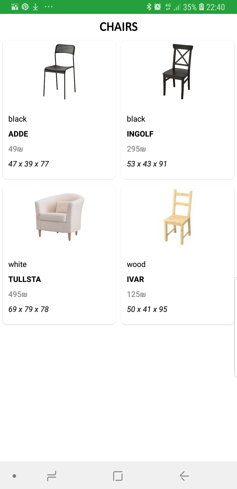
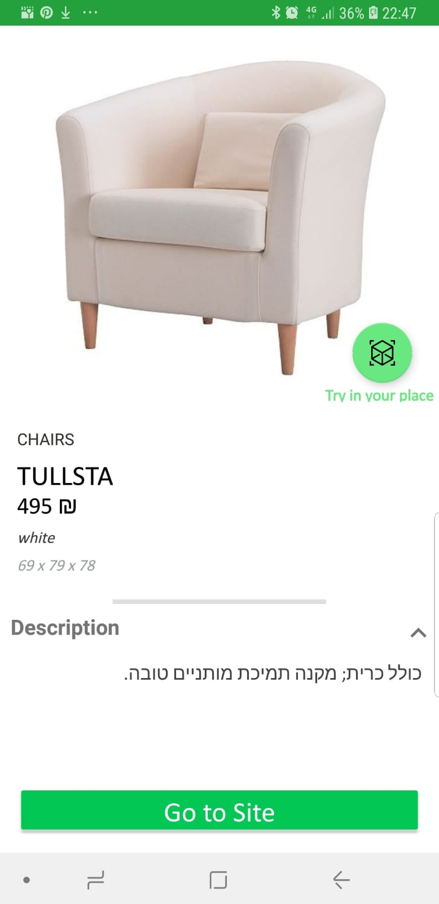

# Couch Mirage


<b>Welcome to Couch Mirage!</b>


Couch mirage is an augmented reality furniture design planner app similar to [IKEA Place](https://play.google.com/store/apps/details?id=com.inter_ikea.place&hl=en_US).
Couch Mirage lets you place 3D models in your place.
By utilizing ARCore and Sceneform libraries by google it allows you to visualize how furniture would
 fit to your home without ever going to the shop.   
Currently Couch Mirage works only in Israel.


Couch Mirage is the final project in the university course #67625 at The Hebrew University in Jerusalem.
See : https://shnaton.huji.ac.il/index.php/NewSyl/67625/2/2020/

## Release
The app can be found on Google Play:

[https://play.google.com/store/apps/details?id=com.huji.couchmirage](https://play.google.com/store/apps/details?id=com.huji.couchmirage)

<b>Latest version is v1.0.2</b>
## Features
- Measuring real world  location
- Searching furniture with  maximum measumrent
- Placing 3D model of <b>real furnitures!</b>  at home
- Taking picture/ vidoe of model at your home
- help page showing how to use the app

## Supported devices

Go to :

[https://developers.google.com/ar/discover/supported-devices](https://developers.google.com/ar/discover/supported-devices)


## Demo


## Screenshots

### Main page searching for plane

### Main page plane discovered

### Main page measuring 3d box

### Furniture Catalog main papge

### Item catalog by category screen

### Item description screen

### The model has been placed!!


### Help page 1


### Help page 2


## project structure
```
.
├── ar                                      # arcore related logic
│   ├── CameraFacingNode.kt                 # a type of node always facing the camera
│   └── MyArFragment.kt                     # custom arframgent 

├── catalog                                 # contains the catalog screens logic
│   ├── CatalogFrontActivity.kt             # main page of the catalog(the one with the categories)
│   ├── DepartmentActivity.kt               # department page activit
│   ├── Department.kt                       # department item 
│   ├── DepartmentRecyclerAdapter.kt        # department adapter
│   ├── DepartmentSourceData.kt             # holds the department images
│   ├── Furniture.kt                        # data class representing a furniture
│   ├── ItemDetailsActivity.kt              #  activity showing details about ites.
                                               Also allows downloading a model to show
│   ├── ItemRecyclerAdapter.kt              # recycle adapter for items
│   └── LoadingDialogFragment.kt            # loading aimation fragment

├── greetings                               # contains logic regearding screens displaying on first app usage
│   ├── AboutAppFrag.kt                     # fragemnt showing details about the app
│   ├── AppDescriptionFrag.kt               # show how to use the app
│   ├── AppTechnicalDescriptionFrag.kt      # shows technical notes regardign ar
│   ├── GreetingActivity.kt                 # the activity showed to the user on first usage
│   ├── HomeFrag.kt                         # first page  showed in the greetnig fragment
│   ├── ObservableWebView.java              # webviewcustom   used to show the privacy notes
│   ├── PrivacyPolicyFrag.kt                # fragments show the privacy policy
│   ├── SquareImageButton.java              # sqaure image button.Extends Button class
│   └── VideoAppFrag.kt                     # video framenget of the video 
                                              shown to the user in the greetings pages

├── Help                                    # use help activit'ies related logic
│   ├── HelpActivity.kt                     # actvity that disaplys usage help to the user
│   ├── HelpDescriptionFrag.kt              # show how to use the app
│   ├── HelpTechnicalDescriptionFrag.kt     # shows technical notes regardign ar
│   └── HelpVideoFrag.kt                    # video framenget of the videds
                                              shown to the user in the help pages

├── InfoFAB.kt                              # the infofab shows no the camera activity.Top left panel
├── MeasurementBox.kt                       # holds logic regearding creating the 3d cube used to
                                              measure a reald world 3d sapcec
├── OpenCameraActivity.kt                   # the main activity.Holds the AR logic

└── utils                                   # utility classes
    ├── PhotoSaver.kt                       # saves ar scene photo
    └── VideoRecorder.java                  # records ar scene video
```

## 3D models
Our app uses Firebase as backend.

The models were takes from multiple sources.
They were preprocessed using blender software and uploaded to firebase using python.
See : https://github.com/arikzilWork/CouchMirageFirebaseLoader

### List of 3d models sources
    * https://free3d.com/3d-models/ikea

    * https://www.polantis.com/ikea/arstid-wall-lamp

    * https://www.turbosquid.com/Search/3D-Models/free/ikea

    * https://clara.io/view/615465b6-822c-4e2a-9b7d-e77b816001a7#

    * https://sketchfab.com/tags/ikea

    * http://www.proviz.info/blog3dfreemodels/3dmodels-ikeafalster

    * http://ikea.csail.mit.edu/

    * https://3dbrute.com/33-ikea-sofa/

    * https://cgtricks.com/high-quality-3d-models-ikea-proviz/

    * https://3dwarehouse.sketchup.com/collection/ue790c74c-6a82-4077-92cd-7f6d2a5f1661/ikea?sortBy=createTime%20DESC&searchTab=model&hl=en&login=true

    * https://3dwarehouse.sketchup.com/collection/c03129ceab823647aac2578a7b9ddb8c/2-IKEA-SOFA?sortBy=createTime%20DESC&searchTab=model&hl=en

    * https://cgdownloads.com/download-slect-ikea-slakt-ikea-3d-model-free/

    * http://www.cgchannel.com/2014/03/download-10-free-models-of-ikea-furniture-from-proviz/

    * https://archibaseplanet.com/download/6f86e1ec.html

## List of tools used

1. [Blender](https://www.blender.org/) - used to edit/prepare models for ARCore to be displayed

2. [adobe after effects](https://www.adobe.com/il_en/products/aftereffects.html?gclid=Cj0KCQjw8fr7BRDSARIsAK0Qqr48Zn77ZN5bvCHuYUj-A8n33hjqkPH6LINI5eQyFHOb9LtmSKOBRUcaAoBNEALw_wcB&sdid=8DN85NTY&mv=search&skwcid=AL!3085!3!340845921979!e!!g!!adobe%20after%20effects&ef_id=Cj0KCQjw8fr7BRDSARIsAK0Qqr48Zn77ZN5bvCHuYUj-A8n33hjqkPH6LINI5eQyFHOb9LtmSKOBRUcaAoBNEALw_wcB:G:s&s_kwcid=AL!3085!3!340845921979!e!!g!!adobe%20after%20effects!1464058443!56263479985) - used to prepare the instruction videos 

3. [free logo design ](https://editor.freelogodesign.org/?lang=en&logo=2895af34-67d1-42d7-8c42-0ddedb973ba0&companyname=&category=0) - used to create the icon


## Credits
[Ariel Zilbershtyin ](https://www.linkedin.com/in/ariel-zilberstein-cmc/)- Computer Engineering student at The Hebrew university
University mail : ariel.zilbershtey@mail.huji.ac.il
id :315314799

[Brahan Wassan  ](https://www.linkedin.com/in/brahan-wassan/)- Math & Computer Science student at The Hebrew university
University mail : Brahan.Wassan@mail.huji.ac.il
id: 320455116